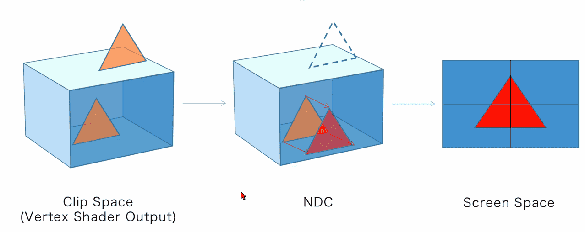
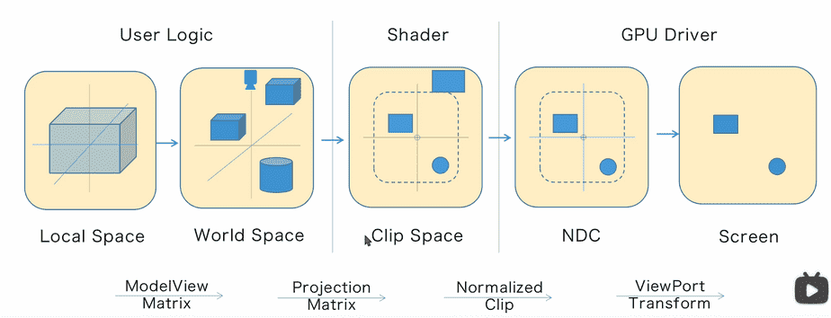
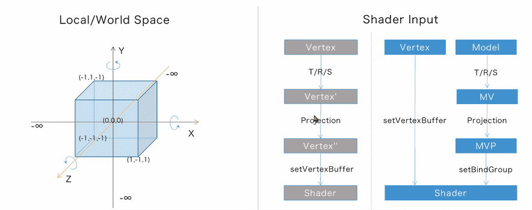

# 3D矩阵变化

## 理论

>`Normalized Device Coordinate`(NDC):标准设备空间

* NDC会将所有z轴坐标(顶点位置)直接拉伸到平面
* 即使这个图形是一个立体的3D图形.如果没有配合动画或者光影的效果也只是一个正方形
* 如果这个图形或者顶点超出了矩形空间,那么GPU会自动裁剪图形或者顶点信息,只保留在NDC中的空间的部分

* 在`Vertex Shader Output`实际输出的最终结果是没有这个空间限制的(可以使用超出-1~1的坐标),也可以任意的放大缩小整个坐标范围.GPU会自动帮助我们将内容裁剪规范到NDC的范围内

>图形的旋转

* `Translate`:xyz在三个坐标上分别平移a,b,c的结果

$
  \begin{vmatrix}
   x+a\\
   y+b\\
   z+c\\
   1\\
  \end{vmatrix}
$
\=
$
  \begin{vmatrix}
   1&0&0&a\\
   0&1&0&b\\
   0&0&1&c\\
   0&0&0&1\\
  \end{vmatrix}
  \begin{vmatrix}
   x\\
   y\\
   z\\
   1\\
  \end{vmatrix}
$

* `Rotate`:绕x轴旋转θ角度的结果

$
  \begin{vmatrix}
   x'\\
   y'\\
   z'\\
   1\\
  \end{vmatrix}
$
\=
$
  \begin{vmatrix}
   1&0&0&0\\
   0&cosθ&-sinθ&0\\
   0&sinθ&cosθ&0\\
   0&0&0&1\\
  \end{vmatrix}
  \begin{vmatrix}
   x\\
   y\\
   z\\
   1\\
  \end{vmatrix}
$

* `Scale`:xyz进行缩放的处理

$
  \begin{vmatrix}
   x'\\
   y'\\
   z'\\
   1\\
  \end{vmatrix}
$
\=
$
  \begin{vmatrix}
   a&0&0&0\\
   0&b&0&0\\
   0&0&c&0\\
   0&0&0&1\\
  \end{vmatrix}
  \begin{vmatrix}
   x\\
   y\\
   z\\
   1\\
  \end{vmatrix}
$

* **投影变换矩阵**:自定义更改整个空间的方向和大小,不许哟啊强行更改坐标系的范围

$
  \begin{vmatrix}
   \frac{2n}{r-l}&0&\frac{r+l}{r-l}&0\\
   0&\frac{2n}{t-b}&\frac{t+b}{t-b}&0\\
   0&0&\frac{-(f+n)}{f-n}&\frac{-2fn}{f-n}\\
   0&0&-1&0\\
  \end{vmatrix}
$

>实现3D变换的完整过程

* 使用独立的坐标系

* 顶点数据的处理过程(三角形转换的过程)
   1. 将`vertex shader`顶点数据先进行平移,旋转,缩放等模型变换,再进行投影变换,最后通过插槽传入到`vertex shader`中,返回结果
      * 当绘制复杂图形时,一个顶点数据被重复利用的情况,例如绘制1000个三角形,如果仅仅是位置不一样,使用这种方式处理就需要使用1000个独立的`vertex buffer`,然后动态的切换这1000个顶点插槽
   2. 顶点数据一旦根据本地的坐标系建立完成,除非模型本身有变化,一般就不会再改变,可以直接将顶点插槽传入到`vertex shader`
      * 再额外准备一个`GPU buffer`存储矩阵的数据,可以将需要变化的**ModelView Matrix**和**Project Matrix**独立的相乘,先计算好一个结果,形成一个统一的`ModelViewProject`矩阵(MVPj矩阵)
      * 把它通过`BindGroup`作为全局参数传入到`vertex shader`中,然后可以在`vertex shader`中将顶点的坐标信息和MVP矩阵相乘得到最终的坐标结果
      * 这种处理的方式的好处是原始数据没有改变,可以复用一个模型的顶点数据.只要切换`BindGroup`就可以绘制不同位置的相同模型
