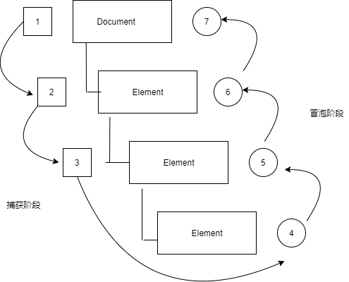

# DOM事件流



## 事件的传播

> W3C

1. 捕获阶段:-在捕获阶段时,从最外层的祖先元素,向目标元素进行事件捕获,但是默认此时不会触发事件
2. 目标阶段:-事件捕获到目标元素,捕获结束开始再目标元素上触发事件
3. 冒泡阶段:-事件从目标元素向他的祖先元素传递,依次触发祖先元素上的事件
   * 注意:
     1. 如果希望在捕获阶段就触发事件,可以将addEventListener()的第三个参数设置为true
     2. 一般情况下我们不希望再捕获阶段触发时间,所以这个一般都是false

```html
<style type="text/css">
  #box1 {
    width: 300px;
    height: 300px;
    background-color: green;
  }
  #box2 {
    width: 200px;
    height: 200px;
    background-color: yellow;
  }
  #box3 {
    width: 150px;
    height: 150px;
    background-color: red;
  }
</style>
<script type="text/javascript">
  window.onload = function () {
    let box1 = document.getElementById("box1");
    let box2 = document.getElementById("box2");
    let box3 = document.getElementById("box3");
    bind(box1, "click", function () {
        alert("我是box1的单机响应函数");
    });
    bind(box2, "click", function () {
        alert("我是box2的单机响应函数");
    });
    bind(box3, "click", function () {
        alert("我是box3的单机响应函数");
    });
  };

  function bind(obj, eventStr, callback) {
    obj.addEventListener(eventStr, callback, false);
  }
</script>

<body>
    <div id="box1">
        <div id="box2">
            <div id="box3"></div>
        </div>
    </div>
</body>
```

## 事件的冒泡(Bubble)

1. 所谓的冒泡指的就是事件的向上传导,当后代的事件被触发时,其祖先元素的相同事件也会被触发
2. 在开发中大部分情况冒泡都是有用的
3. 如果不希望发生事件冒泡可以通过事件对象来取消冒泡

* 解决:将事件对象的cancelBubble设置为true,即可取消冒泡.```event.cancelBubble=true```

```html
<style type="text/css">
  #box1 {
    width: 200px;
    height: 200px;
    background-color: green;
  }
  #s1 {
    background-color: yellow;
  }
</style>
<script type="text/javascript">
  window.onload=function(){
    //为s1绑定一个单机响应函数
    let s1=document.getElementById("s1");
    s1.onclick=function(event){
      alert("我是span的单机响应函数");
      //取消冒泡
      event.cancelBubble=true;
    };
    let box1=document.getElementById("box1");
    box1.onclick=function(event){
      alert("我是div的单机响应函数")
      event.cancelBubble=true;
    };
    document.body.onclick=function(){
      alert("我是body的单机响应函数")
    };
  }
</script>
</head>

<body>
    <div id="box1">
        我是box1
        <span id="s1">
            我是span
        </span>
    </div>
</body>
```

## 事件的委派

> * 指将事件统一绑定给元素的共同的祖先,这样当后代元素上的事件触发时,会一直冒泡到祖先元素.从而通过祖先元素的响应函数来处理事件
> * 事件委派是**利用了冒泡**,通过委派可以减少事件的绑定次数,提高程序的性能

```html
<script type="text/javascript">
  window.onload = function () {
    //点击按钮以后添加超链接
    let btn01 = document.getElementById("btn01");
    let ul = document.getElementById("u1")
    btn01.onclick = function () {
      //创键一个li
      let li = document.createElement("li");
      li.innerHTML = "<a href='javascript:;'class='link'>新建超链接一</a>";
      //将li添加到ul中
      ul.appendChild(li);
    };
     //我们希望只绑定一次事件,即可应用到多个元素上,即使元素是后添加的.我们可以尝试将其绑定给元素的共同祖先元素
    ul.onclick=function(){
       //target:-event中的target表示的触发对象
      if(event.target.className=="link"){
          alert("我是单机响应函数");
      }
    };
  };
</script>

<body>
  <button id="btn01">添加超链接</button>
  <ul id="u1" style="background-color: green;">
    <li>
        <p>我是p元素</p>
    </li>
    <li><a href="javascript:; " class="link">超链接一</a></li>
    <li><a href="javascript:; " class="link">超链接二</a></li>
    <li><a href="javascript:; " class="link">超链接三</a></li>
  </ul>
</body>
```
