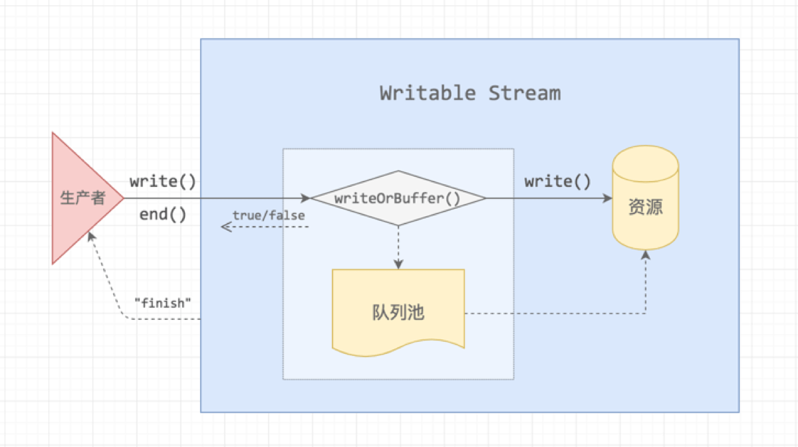
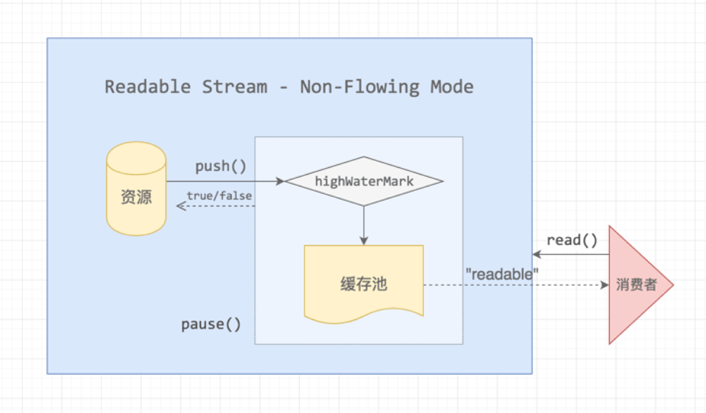

## Stream

>stream 的种类

* `Readable Stream` 可读数据流
* `Writeable Stream` 可写数据流
* `Duplex Stream` 双向数据流,可以同时读和写
* `Transform Stream`转换数据流,可读可写,同时可以转换/处理数据(不常用)

> Buffer:`Writeable`和`Readable`流都将数据存储在内部缓冲区中

* 内部缓冲的数据屈居于传给流的构造函数`highWaterMark`选项.对于普通的流,`highWaterMark`选项指定字节的总数,对于在对象模式下操作的流`highWaterMark`指定对象的总数
* 当实现调用`stream.push(chunk)`时,数据缓存在Readable流中.如果流的消费者没有调用`stream.read()`,则数据会一直留在内部队列,直到被消费
* 当内部读取缓冲区的总大小达到`highWaterMark`指定的阈值,则流将暂时停止从底层资源读取数据,直到可以消费当前缓冲区的数据(流将停止调用内部用于填充读取缓冲区的`readable._read()`)
* 当重复调用`writeable.write(chunk)`方法时,数据会缓存在`Writeable`中.虽然内部的写入缓冲区的总大小低于`highWaterMark`设置的阈值,淡对`writeable.write()`的调用将返回true.一旦内部缓冲区的大小达到活着超过`highWaterMark`,则返回false
* `stream API`的一个关键目标,尤其是`stream.pipe()`方法,是将数据缓冲限制在可接受的水平,以便不同速度的来源和目标不会压倒可用内存
* `highWaterMark`选项是阈值,而不是限制:它规定了流在停止请求更多数据之前缓冲的数据量.
  * 它通常不强制执行严格的内存限制.特定的流实现可能会选择实施更严格的限制,但这样做是可选的.
* `Duplex` 和 `Transform` 流都是 `Readable` 和 `Writable`,因此每个流都维护两个独立的内部缓冲区,用于读取和写入,允许每一端独立操作,同时保持适当且高效的数据流.
  * 例如`net.Socket`实例是`Duplex`流,其`Readable`端允许消费从套接字接收的数据,其`Writable`端允许将数据写入套接字因为数据可能以比接收数据更快或更慢的速度写入套接字,所以每一端都应该独立于另一端进行操作.

### Writable Streams

* TTP requests, on the client
* HTTP responses, on the server
* fs write streams
* zlib streams
* crypto streams
* TCP sockets
* child process stdin
* process.stdout, process.stderr

> 写入过程

* 在数据流过来时,会直接写入到资源池.当写入速度表缓慢时或者暂停时,书记流会进入队列吃缓存起来



* 当生产者写入速度过快,把队列池装满了之后.就会出现**背压**.这个时候需要告诉生产者停产,当队列释放之后.`Writable Stream`会给生产者发送一个`drain`消息,让他恢复生产.

> 事件

1. `close`:当流以及底层资源(例如文件描述符)已关闭时,则会触发`close`事件.表明该事件不会再触发更多事件
   * 如果使用`writable`流是使用`emitClose`选项创建的,则会触发close事件
2. `drain`:如果对`stream.write(chunk)`的调用返回false,则`drain`事件将在适合继续将数据写入流是触发
3. `error`:当数据再写入或者管道数据法伤错误,则会触发`error`事件.监听器回调再调用时传入单个Error参数
   * 除非在创建流时将 `autoDestroy` 选项设置为 `false`,否则当触发 `'error'` 事件时将关闭流
4. `finish`:在调用`stream.end()`方法之后,并且所有的数据都已刷新到底层系统,则触发`finish`中
5. `pipe`:当在可读流上调用`stream.pipe()`方法将此可写流添加到其目标集时,则触发`pipe`事件
6. `unpipe`:当在`Readable`流上调用`stream.unpipe()`方法时,则会触发`unpipe`事件,从其目标集合中删除此`Writable`

> 方法

1. `writable.cork()`
   * `writable.cork()`方法强制所有写入的数据都缓存在内存中.当调用`stream.uncork()`或`stream.end()`方法时,缓冲的数据将被刷新
   * `writable.cork()`的主要目的是适应将几个小块快速连续写入流的情况.`writable.cork()`不是立即将它们转发到底层目标,而是缓冲所有块,直到`writable.uncork()`被调用,如果存在`writable.uncork()`会将它们全部传给`writable._writev()`. 这可以防止在等待处理第一个小块时正在缓冲数据的行头阻塞情况.但是,在不实现`writable._writev()`的情况下使用`writable.cork()`可能会对吞吐量产生不利影响
2. `writable.destroy([error])`
   * **销毁stream**.可选地触发 `'error'` 事件,并且触发 `'close'` 事件(除非 emitClose 设置为 false).
   * 在此调用之后,则可写流已结束,随后对`write()`或`end()`的调用将导致 `ERR_STREAM_DESTROYED` 错误.
   * 这是销毁流的破坏性和直接的方式.先前对 `write()` 的调用可能没有排空,并且可能触发`ERR_STREAM_DESTROYED`错误.
   * 如果数据应该在关闭之前刷新,或者在销毁流之前等待 `'drain'` 事件,则使用`end()`而不是`destroy`
3. `writable.end([chunk[, encoding]][, callback])`
   * 参数
     * `chunk` \<string> | \<Buffer> | \<Uint8Array> | \<any> 可选的要写入的数据.对于不在对象模式下操作的流,`chunk`必须是**字符串**,**Buffer**或**Uint8Array**.对于对象模式的流,chunk可以是除null之外的任何JavaScript值
     * `encoding`: \<string>, chunk为字符串时的编码
     * `callback`:\<Function>, 流结束时的回调
   * 返回: \<this>
   * 调用 `writable.end()` 方法表示不再有数据写入`Writable`可选的`chunk`和`encoding` 参数允许在关闭流之前立即写入最后一个额外的数据块.在调用 `stream.end()` 之后调用 `stream.write()` 方法将引发错误
4. `writable.setDefaultEncoding(encoding)`
   * `writable.setDefaultEncoding()` 方法为`Writable`流设置默认的`encoding`
5. `writable.uncork()`
   * `writable.uncork()`方法会刷新自调用`stream.cork()`以来缓冲的所有数据
   * 当使用`writable.cork()`和`writable.uncork()`管理写入流的缓冲时,使用 `process.nextTick()` 推迟对 `writable.uncork()`的调用. 这样做允许对在给定 Node.js 事件循环阶段中发生的所有 `writable.write()` 调用进行批处理

      ```js
      stream.cork()
      stream.write('some ')
      stream.write('data ')
      process.nextTick(() => stream.uncork())
      ```

   * 如果在一个流上多次调用 `writable.cork()` 方法,则必须调用相同数量的 `writable.uncork()` 调用来刷新缓冲的数据

      ```js
      stream.cork()
      stream.write('some')
      stream.cork()
      stream.write('data')
      process.nextTick(() => {
        stream.uncork()
        // 在第二次调用 uncork() 之前不会刷新数据.
        stream.uncork()
      })
      ```

6. `writable.write(chunk[, encoding][, callback])`
   * 参数
     * `chunk`:和`end()`一样
     * `encoding`: \<string> | \<null>,如果`chunk`为字符串,则w为编码.**默认值: 'utf8'**
     * `callback`:\<Function>当刷新此数据块时的回调
   * 返回: \<boolean> 如果流希望调用代码在继续写入其他数据之前等待`drain`事件被触发,则为false.否则为 true

> 属性

1. `writable.closed`:触发`'close'`之后为 true
2. `writable.destroyed`:在调用 `writable.destroy()` 之后是 true
3. `writable.writable`:如果调用 `writable.write()` 是安全的,则为 true,这意味着流没有被销毁、出错或结束
4. `writable.writableAborted`:返回在触发`finish`之前流是被破销毁或出错
5. `writable.writableEnded`:在调用`writable.end()`之后是true.此属性不指示数据是否已刷新,为此则使用`writable.writableFinished`代替
6. `writable.writableCorked`:需要调用`writable.uncork()`以完全解开流的次数
7. `writable.errored`:如果流因错误而被销毁,则返回false
8. `writable.writableFinished`:在触发 'finish' 事件之前立即设置为 true
9. `writable.writableHighWaterMark`:返回创建此`Writable`时传入的`highWaterMark`的值
10. `writable.writableLength`:此属性包含队列中准备写入的字节数(或对象数).该值提供有关`highWaterMark`状态的内省数据
11. `writable.writableNeedDrain`:如果流的缓冲区已满并且流将触发 'drain',则为 true
12. `writable.writableObjectMode`:给定 `Writable` 流的属性 `objectMode` 的获取器

### Readable Streams

* HTTP responses, on the client
* HTTP requests, on the server
* fs read streams
* zlib streams
* crypto streams
* TCP sockets
* child process stdout and stderr
* process.stdin

>两种读取模式

`Readable`流以两种模式:**流动和暂停**.这些模式与对象模式是分开的. `Readable`流可以处于或不处于对象模式,无论其是处于流动模式还是暂停模式.

   ```JS
   import { Readable } from "node:stream"
   let c = 97
   const rs = new Readable({
     encoding: "utf8",
     read() {
       if (c >= "z".charCodeAt(0)) rs.push(null)
       setTimeout(() => {
         rs.push(String.fromCharCode(++c))
       })
     }
   })
   ```

1. **在流动模式下**(`flowing mode`),数据会自动从底层系统读取,并通过`EventEmitter`接口使用事件尽快提供给应用程序
   * stream上绑定ondata方法就会自动触发这个模式

   ```js
   rs.pipe(process.stdout)
   ```

   * 
   * 资源的数据流并不是直接流向消费者,而是先push到缓存池,缓存池中有一个水位标记`highWatermark`,超过这个标记阈值,push的时候会返回`false`
     * 消费者主动执行`pause()`
     * 消费速度比数据push到缓存吃的生产速度慢
   * <span style="background-color:red">所有的`Readable`流都以暂停模式开始,但可以通过以下方式之一切换到流动模式</span>
     * 添加 `'data'` 事件句柄.
     * 调用 `stream.resume()`方法.
     * 调用 `stream.pipe()`方法将数据发送到 Writable
2. **在暂停模式下**(`Non-Flowing Mode`),必须显式调用`stream.read()`方法以从流中读取数据块
   * 
   * 资源池会不断的往缓冲池输送数据,直到`highWaterMark`阈值,消费者监听了`readable`事件并不会消费数据,需要主动调用`.read([size])`函数才会从缓存池去除,并且可以带上size参数,用多少取多少

   ```js
   rs.on("readable", () => {
     let chunk
     while (null !== (chunk = rs.read())) {
       console.log(chunk)
     }
   })
   ```

   * 注意:数据没达到缓存池都会触发一次`readable`事件,有可能出现,消费者正在消费数据的时候,触发了一次`readable`事件,那么下从回调中read到的数据可能为空的情况.我们可以通过`_readableState.buffer`查看缓存池到底缓存了多少资源

   ```js
   let once = false
   rs.on("readable", (chunk) => {
     console.log(rs._readableState.buffer.length)
     if (once) return;
     once = true;
     console.log(rs.read());
   })
   ```

   * 上面的代码我们只消费一次缓存池的数据,那么在消费后,缓存池又收到了一次资源池的`push`操作,此时还会触发一次`readable`事件,我们可以看看这次存了多大的`buffer`
   * buffer大小是有上限的,默认设置为`16kb`,也就是16384个字节长度,它最大可设置为8Mb,这个值是Node的`new space memory`的大小

* <span style="background-color:red">`Readable`可以使用以下方法之一切换回暂停模式</span>
  * 如果没有管道目标,则通过调用`stream.pause()`方法.
  * 如果有管道目标,则删除所有管道目标.可以通过调用`stream.unpipe()`方法删除多个管道目标.

* 注意:在提供消费或忽略该数据的机制之前,`Readable`不会产生数据.如果消费机制被禁用或移除,则`Readable`将尝试停止产生数据
* 出于向后兼容性的原因,删除`data`事件句柄不会自动暂停流.此外,如果有管道目标,则调用`stream.pause()`将不能保证一旦这些目标排空并要求更多数据,流将保持暂停状态.
* 如果`Readable`切换到**流动模式**并且没有消费者可用于处理数据,则数据将被丢失.
  * 例如,当调用`readable.resume()`方法而没有绑定到`data`事件的监听器时,或者当从流中删除`data`事件句柄时,就会发生这种情况.
* 添加`readable`事件句柄会自动使流停止流动,并且必须通过`readable.read()`来消费数据.如果删除了`readable`事件句柄,则如果有`data`事件句柄,流将再次开始流动.

> 三种状态

* `Readable`流的操作的"两种模式"是对 `Readable` 流实现中发生的更复杂的内部状态管理的简化抽象
* 具体来说,在任何给定的时间点,每个`Readable`都处于三种可能的状态之一:
  * `readable.readableFlowing === null`:暂时没有消费者过来.并且不会生成数据
    * 在此状态下为`data`事件绑定监听器、调用`readable.pipe()`方法,或调用`readable.resume()`方法会将`readable.readableFlowing`切换到`true`.`Readable`会开始主动接受数据
  * `readable.readableFlowing === false`:* 调用`readable.pause()`、`readable.unpipe()`,或者接收背压都会导致`readable.readableFlowing`被设置为false,暂时停止事件的流动,但不会停止数据的生成
    * 在此状态下,为`'data'`事件绑定监听器不会将`readable.readableFlowing`切换到true.
  * `readable.readableFlowing === true`.流动模式

```js
const { PassThrough, Writable } = require('node:stream');
const pass = new PassThrough();
const writable = new Writable();

pass.pipe(writable);
pass.unpipe(writable);
// readableFlowing 现在为 false.

pass.on('data', (chunk) => { console.log(chunk.toString()); });
pass.write('ok');  // 不会触发 'data'.
pass.resume();     // 必须调用才能使流触发 'data'.
```

>事件

1. `close`:当流及其任何底层资源已关闭时,则会触发`close`事件.该事件表明将不再触发更多事件,并且不会发生进一步的计算
   * 如果`Readable`流是使用`emitClose`选项创建的,则始终会触发`close`事件.
2. `data`:**chunk \<Buffer> | \<string> | \<any> 数据块**.对于不在对象模式下操作的流,块将是**字符串**或**Buffer**.对于处于对象模式的流,块可以是除null之外的任何JavaScript值
   * 每当流将数据块的所有权移交给消费者时,则会触发`data`事件. 每当通过调用 `readable.pipe()`,`readable.resume()`,或通过将监听器回调绑定到`data`事件而将流切换到流动模式时,就会发生这种情况
   * 每当调用`readable.read()`方法并且可以返回数据块时,也会触发 'data' 事件.
   * 将 'data' 事件监听器绑定到尚未显式暂停的流,则会将流切换到流动模式. 数据将在可用时立即传入.
   * 如果使用`readable.setEncoding()`方法为流指定了默认编码,则监听器回调将把数据块作为字符串传入.否则数据将作为Buffer传入
3. `end`:当流中没有更多数据可供消费时,则会触发 'end' 事件.
   * 除非数据被完全地消费,否则不会触发 'end' 事件.这可以通过将流切换到流动模式来实现,或者通过重复调用`stream.read()`直到所有数据都被消费完
4. `error`:error事件可以随时由 `Readable` 的实现触发.通常,如果底层流由于底层内部故障而无法生成数据,或者当流实现尝试推送无效数据块时,可能会发生这种情况
   * 监听器回调将传入单个 Error 对象
5. `pause`:当调用`stream.pause()`并且`readableFlowing`不是`false`时,则会触发`pause`事件.
6. `readable`:当有可从流中读取的数据或已到达流的末尾时,则将触发`readable`事件.实际上,`readable`事件表明流有新的信息. 如果数据可用,则`stream.read()`将返回该数据.

   ```js
   const readable = getReadableStreamSomehow();
   readable.on('readable', function() {
     // 现在有一些数据要读取.
     let data;
   
     while ((data = this.read()) !== null) {
       console.log(data);
     }
   })
   ```

   * 如果已经到达流的末尾,则调用`stream.read()`将返回null并触发`end`事件.如果从未读取任何数据,则也是如此
   * 例如,在以下示例中,foo.txt是一个空文件:
  
   ```js
   const fs = require('node:fs');
   const rr = fs.createReadStream('foo.txt');
   rr.on('readable', () => {
     console.log(`readable: ${rr.read()}`);
   });
   rr.on('end', () => {
     console.log('end');
   })
   ```

   * 在某些情况下,为`readable`事件绑定监听器会导致一些数据被读入内部缓冲区
   * 一般来说,`readable.pipe()`和`data`事件机制比`readable`事件更容易理解.但是,处理`readable`可能会导致吞吐量增加
   * 如果同时使用`readable`和`data`,则`readable`优先控制流,即只有在调`stream.read()`时才会触发 'data'.`readableFlowing`属性将变为 false.如果在移除`readable`时有data监听器,则流将开始流动,即data事件将在不调用`resume()`的情况下触发.

7. `resume`当调用`stream.resume()`并且`readableFlowing`不是true时,则会触发`resume`事件

>方法

* `readable.destroy([error])`: **销毁流**可选地触发`error`事件,并且触发`close`事件(除非`emitClose`设置为`false`) 在此调用之后,可读流将释放任何内部资源,随后对`push()`的调用将被忽略
  * 一旦`destroy()`被调用,任何进一步的调用都将是空操作,除了来自`_destroy()`的其他错误可能不会作为error触发.
  * 实现者不应覆盖此方法,而应实现 readable._destroy().
* `readable.isPaused()`:方法返回`Readable`的当前运行状态 这主要由作为`readable.pipe()`方法基础的机制使用.在大多数典型情况下,没有理由直接使用此方法
* `readable.pause()`:方法将导致处于流动模式的流停止触发`data`事件,切换出流动模式.任何可用的数据都将保留在内部缓冲区中
* `readable.pipe(destination[, options])`
  * 参数
    * `destination`:\<stream.Writable> 写入数据的目标
    * `options`:\<Object> 管道选项
      * `end`:\<boolean> 当读取结束时结束写入.**默认值: true**.
  * 返回:\<stream.Writable> 目标,如果它是Duplex或 Transform 流,则允许使用管道链
  * `readable.pipe()`方法将`Writable`流绑定到`readable`,使其自动切换到流动模式并将其所有数据推送到绑定的 `Writable`. 数据流将被自动管理,以便目标`Writable`流不会被更快的`Readable`流漫过.

  * 以下示例将 `readable` 中的所有数据通过管道传输到名为 `file.txt` 的文件中：

   ```js
   const fs = require('node:fs');
   const readable = getReadableStreamSomehow();
   const writable = fs.createWriteStream('file.txt');
   // 可读流的所有数据进入 'file.txt'
   readable.pipe(writable);
   ```

  * 可以将多个`Writable`流绑定到单个`Readable`流
  * `readable.pipe()`方法返回对目标流的引用,从而可以建立管道流链

   ```js
   const fs = require('node:fs');
   const r = fs.createReadStream('file.txt');
   const z = zlib.createGzip();
   const w = fs.createWriteStream('file.txt.gz');
   r.pipe(z).pipe(w);
   ```

  * 默认情况下,当源`Readable`流触发'end'时,则在目标Writable流上调用stream.end(),因此目标不再可写.要禁用此默认行为,可以将 end 选项作为 false 传入,从而使目标流保持打开状态:

   ```js
   reader.pipe(writer, { end: false });
   reader.on('end', () => {
     writer.end('Goodbye\n');
   })
   ```

  * 有个重要的注意事项,如果`Readable`流在处理过程中触发错误,则`Writable`目标不会自动关闭.如果发生错误,则需要手动关闭每个流以防止内存泄漏.
  * `process.stderr`和`process.stdout`.Writable 流在 Node.js 进程退出之前永远不会关闭,无论指定的选项如何.

* `readable.read([size])`
  * `size`\<number> 用于指定要读取的数据量的可选参数
  * 返回: `<string> | <Buffer> | <null> | <any>`
  * `readable.read()`方法从内部缓冲区中读取数据并返回.如果没有数据可以读取,则返回null.
    * 默认情况下,除非使用`readable.setEncoding()`方法指定了编码或流在对象模式下运行,否则数据将作为 Buffer对象返回.
  * 可选的 size 参数指定要读取的特定字节数.如果无法读取 size 字节,则将返回 null,除非流已结束,在这种情况下,将返回内部缓冲区中剩余的所有数据
  * 如果未指定size参数,则将返回内部缓冲区中包含的所有数据.
  * `size`参数必须小于或等于 1 GiB
  * `readable.read()`方法应该只在暂停模式下操作的 Readable 流上调用.在流动模式下,会自动调用`readable.read()`,直到内部缓冲区完全排空.

    ```js
    const readable = getReadableStreamSomehow();

    // 随着数据被缓冲,'readable' 可能会被多次触发
    readable.on('readable', () => {
      let chunk;
      console.log('Stream is readable (new data received in buffer)');
      // 使用循环来确保读取所有当前可用的数据
      while (null !== (chunk = readable.read())) {
        console.log(`Read ${chunk.length} bytes of data...`);
      }
    });
    
    // 当没有更多可用数据时,则触发一次 'end'.
    readable.on('end', () => {
      console.log('Reached end of stream.');
    });
    ```

* `readable.resume()`:`readable.resume()`方法使被显式暂停的 Readable 流恢复触发 'data' 事件,将流切换到流动模式.
  * `readable.resume()`方法可用于完全地消费流中的数据,而无需实际处理任何数据

   ```js
   getReadableStreamSomehow()
     .resume()
     .on('end', () => {
       console.log('Reached the end, but did not read anything.');
     });
   ```

  * 如果有 'readable' 事件监听器,则 `readable.resume()` 方法不起作用
* `readable.setEncoding(encoding)`
  * `encoding`:\<string> 要使用的编码.
  * `readable.setEncoding()`方法为从Readable流读取的数据设置字符编码
  * 默认情况下,没有分配编码,流数据将作为 Buffer 对象返回.设置编码会导致流数据作为指定编码的字符串而不是 Buffer 对象返回. 例如,调用`readable.setEncoding('utf8')`将导致输出数据被解释为 UTF-8 数据,并作为字符串传入
  * 调用`readable.setEncoding('hex')`将使数据以十六进制字符串格式进行编码.
  * Readable 流将正确地处理通过流传递的多字节字符,否则如果简单地从流中提取为 Buffer 对象,这些字符将无法正确解码

   ```js
   const readable = getReadableStreamSomehow();
   readable.setEncoding('utf8');
   readable.on('data', (chunk) => {
     assert.equal(typeof chunk, 'string');
     console.log('Got %d characters of string data:', chunk.length);
   });
   ```

* `readable.unpipe([destination])`
  * `destination`: \<stream.Writable> 可选的要取消管道的特定流
  * `readable.unpipe()`方法分离先前使用`stream.pipe()`方法绑定的`Writable`流.
  * 如果未指定`destination`,则所有管道都将分离.
  * 如果指定了`destination`,但没有为其设置管道,则该方法不执行任何操作.

   ```js
   const fs = require('node:fs');
   const readable = getReadableStreamSomehow();
   const writable = fs.createWriteStream('file.txt');
   // 可读流的所有数据进入 'file.txt',
   // 但只有第一秒.
   readable.pipe(writable);
   setTimeout(() => {
     console.log('Stop writing to file.txt.');
     readable.unpipe(writable);
     console.log('Manually close the file stream.');
     writable.end();
   }, 1000);
   ```

>属性

* `readable.closed`:触发`close`之后为true.
* `readable.destroyed`:在调用`readable.destroy()`之后是 true.
* `readable.readable`:如果调用 readable.read() 是安全的,则为 true,这意味着流尚未被销毁或触发 'error' 或 'end'.
* `readable.readableAborted`:返回在触发 'end' 之前流是被破销毁或出错
* `readable.readableDidRead`:返回是否已触发 'data'
* `readable.readableEncoding`:给定 Readable流的属性encoding 的获取器.可以使用`readable.setEncoding()`方法设置 `encoding`属性
* `readable.readableEnded`:当触发 'end' 事件时变为 true
* `eadable.errored`:如果流因错误而被销毁,则返回`error`
* `readable.readableFlowing`:反映了 Readable 流的当前三种状态之一
* `readable.readableHighWaterMark`:返回创建此 Readable 时传入的 highWaterMark 的值
* `readable.readableLength`:此属性包含队列中准备读取的字节数(或对象数).该值提供有关 `highWaterMark`状态的内省数据
* `readable.readableObjectMode`:给定 Readable 流的属性 objectMode 的获取器

### Duplex Stream

>Duplex,双工的意思,它的输入和输出可以没有任何关系


```js
import { Duplex } from "node:stream"

const duplex = new Duplex()

//readable
let i = 2
duplex._read = function () {
  this.push(i-- ? 'read' + i : null)
}
duplex.on("data", data => console.log(data.toString()))

//writeable
duplex._write = function (chunk, encoding, callback) {
  console.log(chunk.toString())
  callback()
}
duplex.write("write")
// write
// read1
// read0
```
